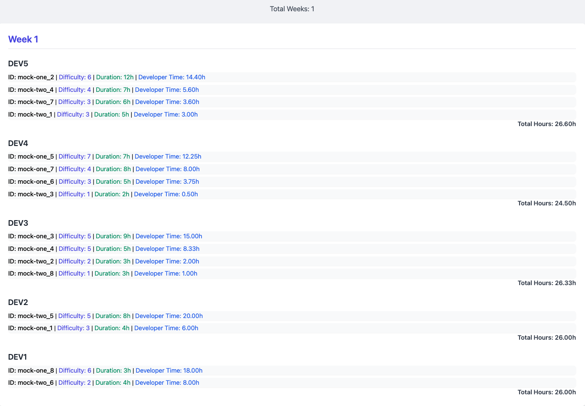

## **Task Distribution**

**Task Distribution App Using Laravel, Docker, and PostgreSQL**

---

## **Table of Contents**

1. [Introduction](#introduction)
2. [Features](#features)
3. [Architecture and Design Patterns](#architecture-and-design-patterns)
4. [Prerequisites](#prerequisites)
5. [Setup and Installation](#setup-and-installation)
6. [Running the Application](#running-the-application)
7. [Testing](#testing)
8. [Data Visualization](#data-visualization)
---

## **Introduction**

This project is a Laravel-based application designed to distribute tasks among developers efficiently. It leverages Docker for containerization, Nginx as the web server, PHP 8.1 for server-side scripting, and PostgreSQL for the database. The application implements various design patterns to ensure clean code architecture and maintainability.

---

## **Features**

- **Task Fetching:** Retrieves tasks from multiple external providers.
- **Task Distribution:** Distributes tasks among developers based on complexity and developer capacity.
- **Partial Task Assignment:** Handles tasks exceeding developer capacity by assigning them over multiple weeks.
- **Visualization:** Provides an interface to visualize task distribution across developers and weeks.
- **Dockerized Environment:** Easy setup using Docker and Docker Compose.
- **Unit Testing:** Comprehensive tests using PHPUnit and an in-memory SQLite database.

---

## **Architecture and Design Patterns**

The application employs several design patterns:

- **Strategy Pattern:** For flexible task distribution strategies.
- **Factory Pattern:** To instantiate different task providers.
- **Adapter Pattern:** To normalize data from various external task providers.
- **Dependency Injection:** For loose coupling and easier testing.

---

## **Prerequisites**

Ensure you have the following installed:

- **Docker**: [Install Docker](https://docs.docker.com/get-docker/)
- **Docker Compose**: [Install Docker Compose](https://docs.docker.com/compose/install/)

---

## **Setup and Installation**

Clone the repository:

```bash
git clone https://github.com/turgutahmet/todo-app.git
cd todo-app
```

### **1. Build Docker Containers**

```bash
docker-compose build
docker-compose up -d
```

### **2. Install PHP Dependencies**

```bash
docker-compose exec app composer install
```

### **3. Generate Application Key**

```bash
docker-compose exec app php artisan key:generate
```

### **4. Run Database Migrations**

```bash
docker-compose exec app php artisan migrate
```

### **5. Fetch Tasks from External Providers**

```bash
docker-compose exec app php artisan todos:fetch
```

---

## **Running the Application**

Access the application in your web browser:

```bash
http://localhost:8080
```

*(Note: Adjust the port if you've changed it in your `docker-compose.yml` or `.env` file.)*

---

## **Testing**

To run the unit tests:

```bash
docker-compose exec app php artisan test
```

This will execute all unit tests, ensuring that the task distribution logic works as expected.

---

## **Data Visualization**

### **Algorithm Visualization**


*This diagram illustrates the task distribution algorithm, showcasing how tasks are assigned to developers over multiple weeks.*

### **Distribution Result**



*An example of the task distribution output, displaying tasks assigned to each developer per week.*
